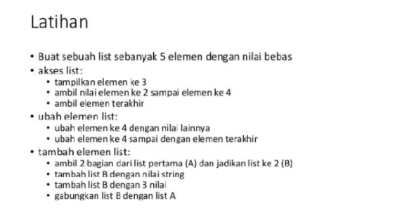
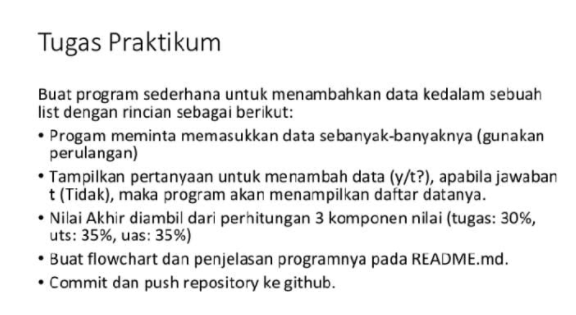
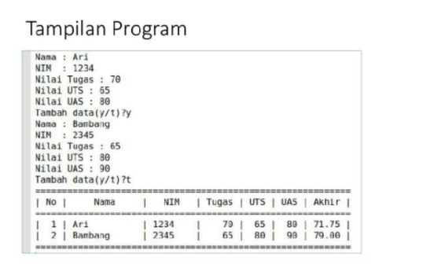
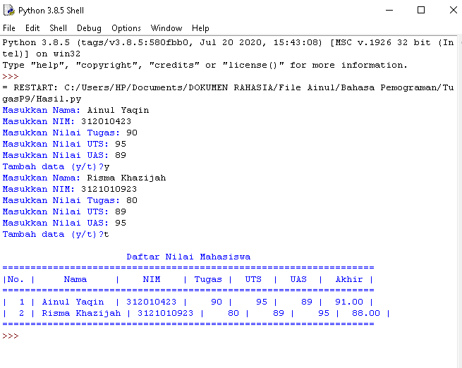
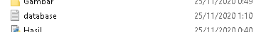

**Nama : Ainul Yaqin**
**NIM : 312010423**
**Kelas : TI.20.A.1**

# **Program Data Mahasiswa**

# Pertemuan 9 - Praktikum Modul 4  
Pada praktikum kali ini saya akan membuat program sederhana untuk menginput data kedalam list.  
  
  
  

Berikut Inputannya :

`nilai = []`  
`ulang = True`  

`while ulang:`  
`    nama = input("Masukkan Nama: ")`  
`    nim = input("Masukkan NIM: ")`  
`    tugas = int(input("Masukkan Nilai Tugas: "))`  
`    uts = int(input("Masukkan Nilai UTS: "))`  
`    uas = int(input("Masukkan Nilai UAS: "))`  
`    akhir = (tugas * 30/100) + (uts * 35/100) + (uas * 35/100)`

`    nilai.append([nama, nim, tugas, uts, uas, int(akhir)])`  
`    if (input("Tambah data (y/t)?") == 't'):`  
`        ulang = False`

`print("\n                      Daftar Nilai Mahasiswa")`  
`print("==================================================================")`  
`print("|No. |     Nama     |    NIM    | Tugas |  UTS  |  UAS  |  Akhir |")`  
`print("==================================================================")`  
`i = 0`  
`for item in nilai:`  
`    i += 1`  
`    print("| {no:2d} | {nama:12s} | {nim:9s} | {tugas:5d} | {uts:5d} | {uas:5d} | {akhir:6.2f} |"`  
`          .format(no=i, nama=item[0], nim=item[1], tugas=item[2], uts=item[3], uas=item[4], akhir=item[5]))`  
`print("==================================================================")`

`#Program Data Mahasiswa`

`Program praktikum`

# Penjelasan :  
* Pertama kita membuat Variabel list kosong.  
`nilai = []`  
`ulang = True`  
Variabel `ulang = True` digunakan untuk mengontrol perulangan.  
* Lalu kita membuat kondisi perulangan dan statement yang akan dijalankan ketika perulangan terjadi.  
`while ulang:`  
`    nama = input("Masukkan Nama: ")`  
`    nim = input("Masukkan NIM: ")`  
`    tugas = int(input("Masukkan Nilai Tugas: "))`  
`    uts = int(input("Masukkan Nilai UTS: "))`  
`    uas = int(input("Masukkan Nilai UTS: "))`  
`    akhir = (tugas * 30/100) + (uts * 35/100) + (uas * 35 100)`

`    nilai.append([nama, nim, tugas, uts, uas, int(akhir)])`  
Dari statement diatas, kita akan diminta untuk menginput nama, nim, nilai tugas, nilai uts, dan nilai uas, lalu system akan menjumlahkan nilai-nilai tersebut dan menghasilkan nilai akhir. Setelah menginput berbagai data atau item, inputan item tersebut akan masuk ke dalam list 'nilai'  
*  Setelah membuat perulangan, kita membuat statement untuk menghentikan atau keluar dari perulangan yang terjadi.  
`if (input("Tambah data (y/t)?") == 't'):`  
`        ulang = False`  
Untuk keluar dari perulangan kita hanya perlu menginputkan 't' apabila diminta pada saat program dijalankan. 't' akan membuat variable `ulang = True` menjadi `ulang = False` yang mana akan menghentikan perulangan yang terjadi.  
* Dan Yang terakhir kita akan mencetak hasil dari program yang telah di buat.  
`print("\n                      Daftar Nilai Mahasiswa")`  
`print("==================================================================")`  
`print("|No. |     Nama     |    NIM    | Tugas |  UTS  |  UAS  |  Akhir |")`  
`print("==================================================================")`  
`i = 0`  
`for item in nilai:`  
`    i += 1`  
`    print("| {no:2d} | {nama:12s} | {nim:9s} | {tugas:5d} | {uts:5d} | {uas:5d} | {akhir:6.2f} |"`  
`          .format(no=i, nama=item[0], nim=item[1], tugas=item[2], uts=item[3], uas=item[4], akhir=item[5]))`  
`print("==================================================================")`

**Berikut ini Hasinya:**

  

# Pertemuan 9 Modul 5  
Pada Pertemuan 9 Modul 5 dosen memberikan saya tugas untuk membuat program sederhana yang akan menampilkan daftar nilai mahasiswa. berikut soal yang dosen berikan:  
  
# Penjelasan :  
* Penggunaan if c.lower() if c.lower() fungsinya apabila user menginputkan dengan huruf besar, maka otomatis akan menjadi huruf kecil sehingga kondisi yang diinginkan tercapai. contoh: `if c.lower() == 'q'`  
* Penggunaan while True while True berfungsi untuk mendeteksi jika format yang diinputkan bukan berupa type maka akan muncul eror  
* Penggunaan else Fungsi else ialah jika tidak eror dan type yang dimasukan sesuai maka proses while True.  
* Pengunaan valueError Fungsinya apabila diinputkan bukan berupa type maka hasilnya error (valueError)  
berikut source codenya:  
`                    while (True):`  
`                        nama = input(" Nama : ")`  
`                        if nama == '':`  
`                            P(' Masukan dengan Nama Dengan Benar')`  
`                        else:`  
`                            break`  
`                    while (True):`  
`                        try:`  
`                            nim  = int(input(" NIM  : "))`  
`                            if nim == '':`  
`                                P(' Masukan Nim dengan Angka')`  
`                        except ValueError:`  
`                            P(' Masukan Nim dengan Angka')`  
`                        else:`  
`                            break`  
`                    while (True):`  
`                        try:`  
`                            tugas  = int(input(" TUGAS  : "))`  
`                            if tugas == '':`  
`                                P(' Masukan TUGAS dengan Angka')`  
`                        except ValueError:
`                            P(' Masukan TUGAS dengan Angka')`  
`                        else:`  
`                            break`  
* Pengunaan round dan float round digunakan untuk menentukan banyaknya angka di belakang koma, sedangkan float digunakan untuk mengubah bilangan menjadi float(desimal)  
Berukut Source codenya:  
`akhir = round((float(tugas) * 0.3)+(float(uts) * 0.35)+(float(uas) * 0.35),2)`  
`        i.write('\nNama : '+nama+'|Nim : '+str(nim)+'|Tugas : '+str(tugas)+'|UTS : '+str(uts)+'|UAS : '+str(uas)+"|Akhir : "+str(akhir)+'\n')`  
`        i.close()`  
* Penggunaan Database.txt Berguna untuk menyimpan data dari inputan.  

`#Membuat Program Sederhana Menampilkan Daftar Nilai Mahasiswa`  
`#Ainul Yaqin`  
`#TI.20.A.1`

`P = print`  
`while True:`  
`    P("")`  
`    P("")`  
`    c = input("L)ihat, T)ambah, U)bah, H)apus, C)ari, K)eluar: ")`  
`    if c.lower() == 'q':`  
`        break`  
`    elif c.lower() == 'l':`  
`        i = open('database.txt','r').read().splitlines()`  
`        P(" ╔═════════════════════════════════════════════════════════════════════╗")`  
`        P(" ╠════════════════════════════ DAFTAR KONTAK ══════════════════════════╣")`  
`        P(" ╠══════════════════╦══════════════════╦═══════╦═══════╦═══════╦═══════╣")`  
`        P(" ║      NAMA        ║       NIM        ║ TUGAS ║  UTS  ║  UAS  ║ AKHIR ║")`  
`        P(" ╠══════════════════╬══════════════════╬═══════╬═══════╬═══════╬═══════╣")`  
`        for l in i:`  
`            if l == '':`  
`                pass`  
`            else:`  
`                l1 = l.replace('Nama : ','').replace('Nim : ','').replace('Tugas : ','').replace('UTS : ','').replace('UAS : ','').replace('Akhir : ','')`  
`                na,ni,tu,uts,uas,akhir = l1.strip().split('|')`  
`                P((' ║ ')+(na[:15]).ljust(17,'.')+('║ ')+(ni).ljust(17)+('║ ')+(tu).ljust(6)+('║ ')+(uts).ljust(6)+('║ ')+(uas).ljust(6)+('║ ')+(akhir).ljust(6)+('║'))`  
`        P(" ╚══════════════════╩══════════════════╩═══════╩═══════╩═══════╩═══════╝")`  
`    elif c.lower() == 'c':`  
`        cari = input(' Mencari : ')`  
`        i = open('database.txt','r').read().splitlines()`  
`        P(" ╔═════════════════════════════════════════════════════════════════════╗")`  
`        P(" ╠════════════════════════════ DAFTAR KONTAK ══════════════════════════╣")`  
`        P(" ╠══════════════════╦══════════════════╦═══════╦═══════╦═══════╦═══════╣")`  
`        P(" ║      NAMA        ║       NIM        ║ TUGAS ║  UTS  ║  UAS  ║ AKHIR ║")`  
`        P(" ╠══════════════════╬══════════════════╬═══════╬═══════╬═══════╬═══════╣")`  
`        for l in i:`  
`            if l == '':`  
`                pass`  
`            elif cari in l:`  
`                l1 = l.replace('Nama : ','').replace('Nim : ','').replace('Tugas : ','').replace('UTS : ','').replace('UAS : ','').replace('Akhir : ','')`  
`                na,ni,tu,uts,uas,akhir = l1.strip().split('|')`  
`                P((' ║ ')+(na).ljust(17)+('║ ')+(ni).ljust(17)+('║ ')+(tu).ljust(6)+('║ ')+(uts).ljust(6)+('║ ')+(uas).ljust(6)+('║ ')+(akhir).ljust(6)+('║'))`  
`        P(" ╚══════════════════╩══════════════════╩═══════╩═══════╩═══════╩═══════╝")`  
`    elif c.lower() == 'h':`  
`        u = open('database.txt','r').read().splitlines()`  
`        target = input(' Masukan Nama : ')`  
`        nm = []`  
`        for l in u:`  
`            if l == '':`  
`                pass`  
`            else:`  
`                l1 = l.replace('Nama : ','').replace('Nim : ','').replace('Tugas : ','').replace('UTS : ','').replace('UAS : ','').replace('Akhir : ','')`  
`                na,ni,tu,uts,uas,akhir = l1.strip().split('|')`  
`                if str(na) == str(target):`  
`                    P('BERHASIL MENGHAPUS Data %s'%(target))`  
`                    pass`  
`                else:`  
`                    nm.append(str(l)+'\n')`  
`        new = open('database.txt','w')`  
`        new.write(str(nm))`  
`        new.close()`  
`        new = open('database.txt','r').read().splitlines()`  
`        new1 = open('database.txt','w')`  
`        new1.close()`  
`        new2 = open('database.txt','a')`  
`        for i in new:`  
`            i2 = i.replace("['","").replace("\\n', '", "\n").replace("']","").replace("\\n",'')`  
`            new2.write(i2)`  
`        new2.close()`  
`    elif c.lower() == 'u':`  
`        u = open('database.txt','r').read().splitlines()`  
`        target = input(' Masukan Nama : ')`  
`        nm = []`  
`        for l in u:`  
`            if l == '':`  
`                pass`  
`            else:`  
`                l1 = l.replace('Nama : ','').replace('Nim : ','').replace('Tugas : ','').replace('UTS : ','').replace('UAS : ','').replace('Akhir : ','')`  
`                na,ni,tu,uts,uas,akhir = l1.strip().split('|')`  
`                if na == target:`  
`                    P(' Mengedit Data %s'%(target))`  
`                    while (True):`  
`                        nama = input(" Nama : ")`  
`                        if nama == '':`  
`                            P(' Masukan dengan Nama Dengan Benar')`  
`                        else:`  
`                            break`  
`                    while (True):`  
`                        try:`  
`                            nim  = int(input(" NIM  : "))`  
`                            if nim == '':`  
`                                P(' Masukan Nim dengan Angka')`  
`                        except ValueError:`  
`                            P(' Masukan Nim dengan Angka')`  
`                        else:`  
`                            break`  
`                    while (True):`  
`                        try:`  
`                            tugas  = int(input(" TUGAS  : "))`  
`                            if tugas == '':`  
`                                P(' Masukan TUGAS dengan Angka')`  
`                        except ValueError:`  
`                            P(' Masukan TUGAS dengan Angka')`  
`                        else:`  
`                            break`  
`                    while (True):`  
`                        try:`  
`                            uts  = int(input(" UTS  : "))`  
`                            if uts == '':` ,br
`                                P(' Masukan UTS dengan Angka')`  
`                        except ValueError:`  
`                            P(' Masukan UTS dengan Angka')`  
`                        else:`  
`                            break`  
`                    while (True):`  
`                        try:`  
`                            uas  = int(input(" UAS  : "))`  
`                            if uas == '':`  
`                                P(' Masukan UAS dengan Angka')`  
`                        except ValueError:`  
`                            P(' Masukan UAS dengan Angka')`  
`                        else:`  
`                            break`  
`                    akhir = round((float(tugas) * 0.3)+(float(uts) * 0.35)+(float(uas) * 0.35),2)`  
`                    edit  =('Nama : '+nama+'|Nim : '+str(nim)+'|Tugas : '+str(tugas)+'|UTS : '+str(uts)+'|UAS : '+str(uas)+"|Akhir : "+str(akhir)+'\n')`  
`                    nm.append(edit+'\n')`  
`                else:`  
`                    nm.append(str(l)+'\n')`  
`        new = open('database.txt','w')`  
`        new.write(str(nm))`  
`        new.close()`  
`        new = open('database.txt','r').read().splitlines()`  
`        new1 = open('database.txt','w')`  
`        new1.close()`  
`        new2 = open('database.txt','a')`  
`        for i in new:`  
`            i2 = i.replace("['","").replace("\\n', '", "\n").replace("']","").replace("\\n","\n")`  
`            new2.write(i2+'\n')`  
`        new2.close()`  
`    elif c.lower() == 't':`  
`        i = open('database.txt','a')`  
`        P(" Tambah Kontak")`  
`        while (True):`  
`            nama = input(" Nama : ")`  
`            if nama == '':`  
`                P(' Masukan dengan Nama Dengan Benar')`  
`            else:`  
`                break`  
`        while (True):`  
`            try:`  
`                nim  = int(input(" NIM  : "))`  
`                if nim == '':`  
`                    P(' Masukan Nim dengan Angka')`  
`            except ValueError:`  
`                P(' Masukan Nim dengan Angka')`  
`            else:`  
`                break`  
`        while (True):`  
`            try:`  
`                tugas  = int(input(" TUGAS  : "))`  
`                if tugas == '':`  
`                    P(' Masukan TUGAS dengan Angka')`  
`            except ValueError:`  
`                P(' Masukan TUGAS dengan Angka')`  
`            else:`  
`                break`  
`        while (True):`  
`            try:`  
`                uts  = int(input(" UTS  : "))`  
`                if uts == '':`  
`                    P(' Masukan UTS dengan Angka')`  
`            except ValueError:`  
`                P(' Masukan UTS dengan Angka')`  
`            else:`  
`                break`  
`        while (True):`  
`            try:`  
`                uas  = int(input(" UAS  : "))`  
`                if uas == '':`  
`                    P(' Masukan UAS dengan Angka')`  
`            except ValueError:`  
`                P(' Masukan UAS dengan Angka')`  
`            else:`  
`                break`  
`        akhir = round((float(tugas) * 0.3)+(float(uts) * 0.35)+(float(uas) * 0.35),2)`  
`        i.write('\nNama : '+nama+'|Nim : '+str(nim)+'|Tugas : '+str(tugas)+'|UTS : '+str(uts)+'|UAS : '+str(uas)+"|Akhir : "+str(akhir)+'\n')`  
`        i.close()`  
`    else:`  
`        P("Silahkan pilih menu yang tersedia...")`

# Hasil dari source code di atas :  
!